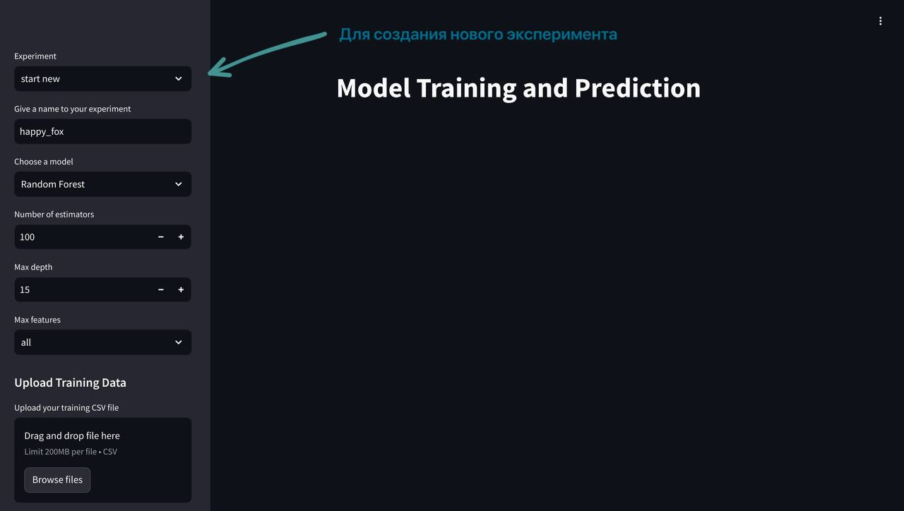
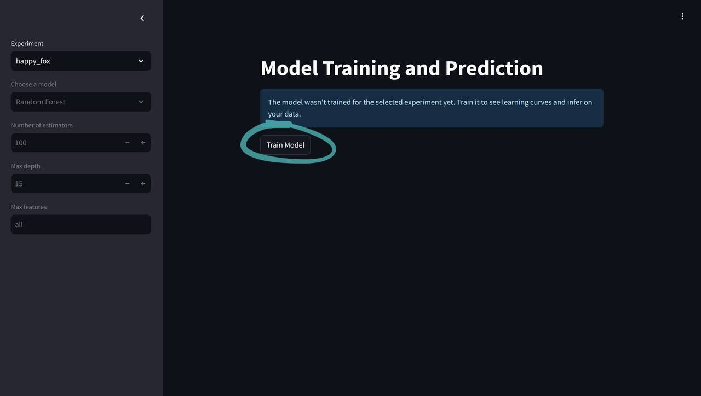
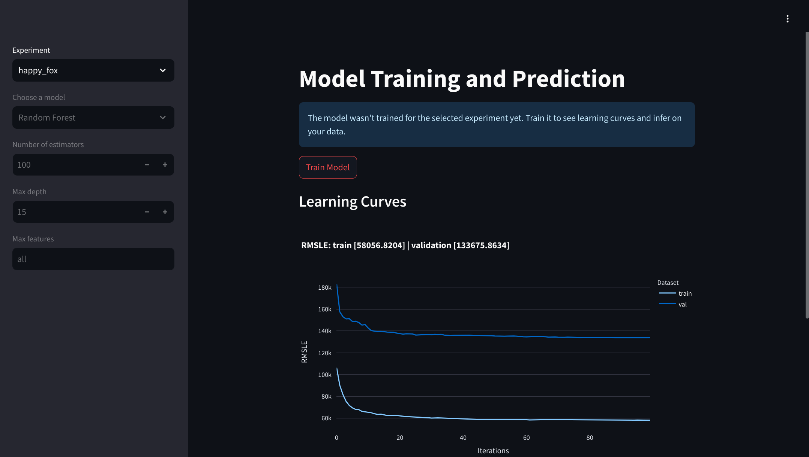
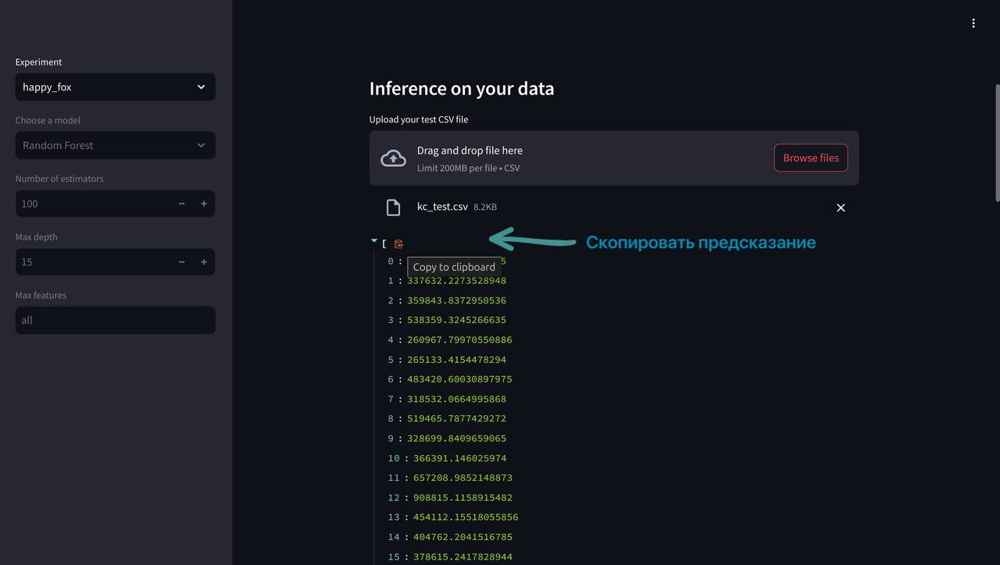

# Как пользоваться сервисом?
## Запуск

В корневой папке проекта необходимо выполнить следующие команды

```
docker compose build
docker compose up
```

Далее предоставим инструкцию по взаимодейсвию с интерфейсом.

## Создание нового эксперимента




## Обучение модели
Для последующей работы необходимо обучить выбранную модель



Далее вы должны получить результаты экспериментов в виде



## Получение предсказаний на новых данных
После обучения модели можно загрузить тестовый набор данных и получить предсказания модели для них.



